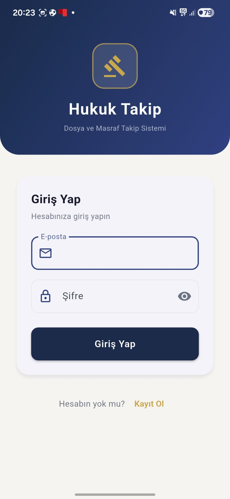
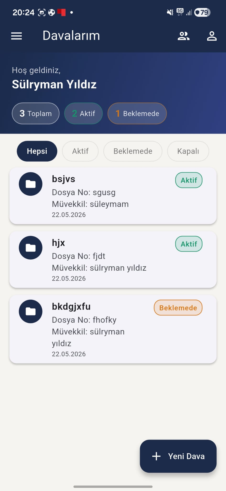
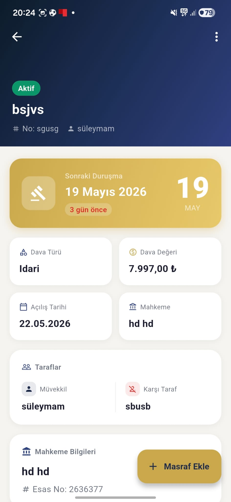
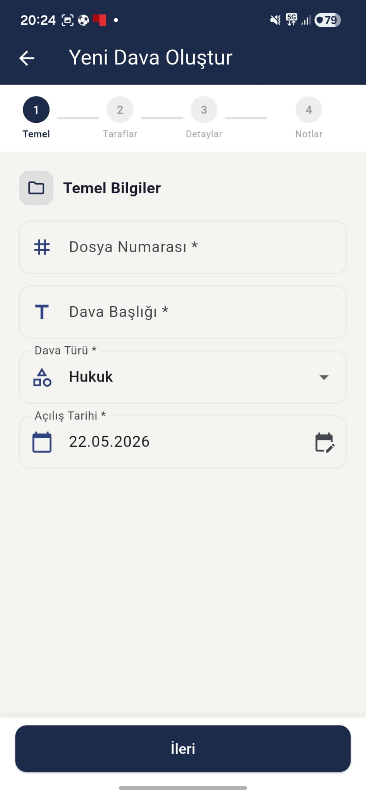
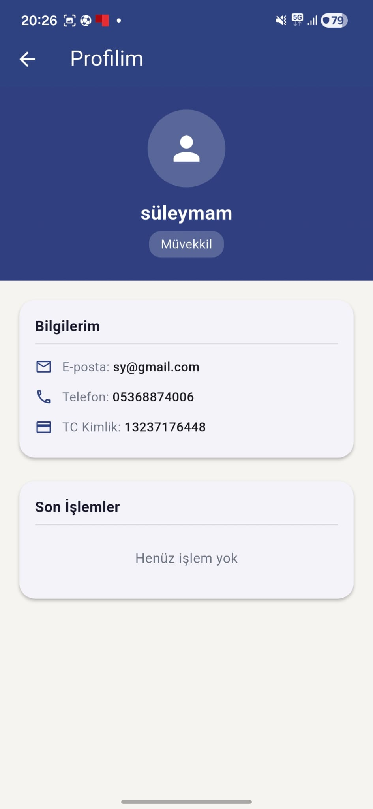

# Hukuk Dosya ve Masraf Takip Sistemi

**Öğrenci:** Süleyman Yıldız  
**Numara:** 243301031  
**Ders:** Mobil Programlama — Selçuk Üniversitesi Teknoloji Fakültesi  
**Dönem:** 2025–2026

---

## Uygulama Hakkında

Avukatların müvekkil dosyalarını, duruşma takvimlerini ve masraflarını dijital ortamda takip edebildiği; müvekkillerin ise kendi davalarını ve avukatlarıyla iletişimi yönettiği Flutter tabanlı mobil uygulama.

---

## Kullanıcı Rolleri

| Rol | Yetkiler |
|-----|----------|
| **Avukat** | Dava oluşturma, müvekkil atama, masraf ekleme/silme, duruşma takibi, durum güncelleme, müvekkil taleplerini kabul/reddetme |
| **Müvekkil** | Kendi davalarını görüntüleme, masraf takibi, avukat arama ve talep gönderme |

---

## Test Hesapları

| Rol | E-posta | Şifre |
|-----|---------|-------|
| **Avukat** | avukat@test.com | Test1234! |
| **Müvekkil** | muvekkil@test.com | Test1234! |

---

## Teknik Yapı

- **Framework:** Flutter 3.x (Dart)
- **Backend:** Supabase (Auth + PostgreSQL)
- **Mimari:** Feature-based (avukat / müvekkil / auth / profile)
- **State Management:** Provider

### Kullanılan Paketler

| Paket | Versiyon | Kullanım Amacı |
|-------|----------|----------------|
| `supabase_flutter` | ^2.8.4 | Kimlik doğrulama ve veritabanı |
| `provider` | ^6.1.2 | State management |
| `intl` | ^0.20.1 | Tarih ve para formatlama |
| `uuid` | ^4.5.1 | Benzersiz ID üretimi |

---

## Ekranlar (11 Ekran)

| # | Ekran | Rol |
|---|-------|-----|
| 1 | Splash Screen | Ortak |
| 2 | Giriş Ekranı | Ortak |
| 3 | Kayıt Ekranı | Ortak |
| 4 | Avukat Ana Ekran (Dava Listesi + Filtre) | Avukat |
| 5 | Dava Oluşturma (4 Adımlı Form) | Avukat |
| 6 | Dava Detay (Masraf Listesi + Durum) | Avukat |
| 7 | Masraf Ekleme | Avukat |
| 8 | Duruşma Takvimi | Avukat |
| 9 | Müvekkil Talepleri | Avukat |
| 10 | Müvekkil Ana Ekran | Müvekkil |
| 11 | Müvekkil Dava Detay | Müvekkil |
| 12 | Avukat Arama & Talep | Müvekkil |
| 13 | Profil Ekranı | Ortak |

---

## Ekran Görüntüleri

### Giriş & Kayıt


### Avukat Ana Ekran


### Dava Detay


### Dava Oluşturma Formu


### Duruşma Takvimi


### Müvekkil Ekranı


---

## Özellikler

- **Kimlik Doğrulama:** Supabase Auth — uygulama kapatılıp açıldığında oturum korunur
- **Log Kaydı:** Her işlemde (giriş, dava oluşturma, masraf ekleme vb.) otomatik log
- **Dava Yönetimi:** Dava türü, mahkeme, karşı taraf, esas no, duruşma tarihi, dava değeri
- **Masraf Takibi:** Masraf ekleme, silme, toplam hesaplama
- **Duruşma Takvimi:** Yaklaşan duruşmalar, geri sayım, aciliyet renklendirmesi
- **Avukat–Müvekkil Eşleşmesi:** Müvekkil avukat arar, talep gönderir; avukat kabul/reddeder
- **TC Kimlik Doğrulama:** Gerçek Türkiye Cumhuriyeti algoritması ile doğrulama
- **Baro Sicil No Doğrulama:** Özel checksum algoritması

---

## Veritabanı Tabloları (Supabase)

- `profiles` — Kullanıcı profilleri (avukat/müvekkil rolleri)
- `cases` — Dava kayıtları
- `expenses` — Masraf kayıtları
- `case_documents` — Belge referansları
- `lawyer_client_requests` — Avukat-müvekkil eşleşme talepleri
- `activity_logs` — İşlem log kayıtları

---

## Branch Stratejisi

```
main
├── mb-001/auth-feature   (kayıt, giriş, profil)
└── mb-002/case-feature   (dava yönetimi, masraflar)
```
